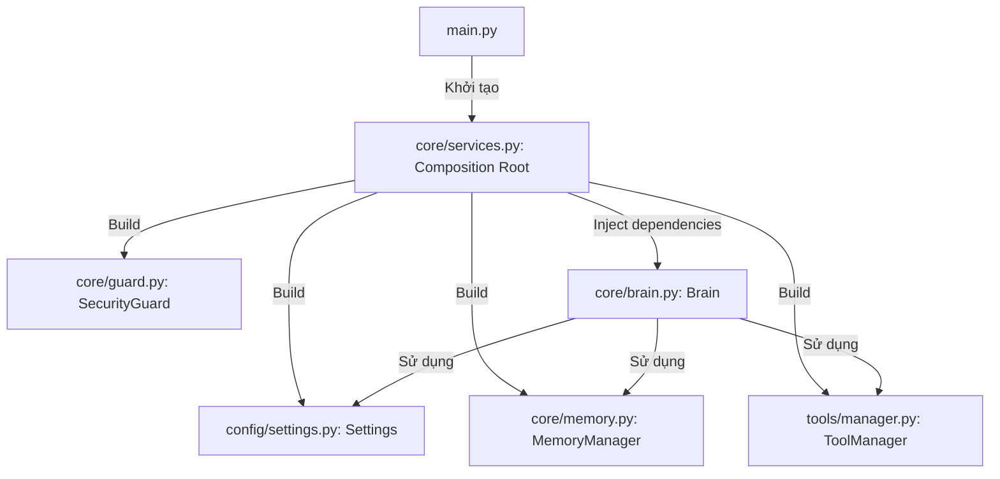

# Hướng dẫn phát triển F.R.I.D.A.Y (Development Guide)

Tài liệu này mô tả chi tiết cấu trúc dự án, kiến trúc mã nguồn và các bước phát triển, mở rộng hệ thống trợ lý ảo F.R.I.D.A.Y.

---

## 1. Cấu trúc thư mục dự án

Dự án được cấu trúc theo dạng module hóa cao độ:

```text
friday/
├── main.py                 # Điểm khởi động ứng dụng (CLI entry point)
├── requirements.txt        # Danh sách các thư viện phụ thuộc Python
├── .env                    # Tệp cấu hình cục bộ (chứa API keys, đường dẫn, không commit)
├── .env.example            # Bản mẫu tệp cấu hình
├── .gitignore              # Quy tắc bỏ qua của git
├── audio/                  # Module xử lý âm thanh (Giọng nói & Tổng hợp tiếng nói)
│   └── __init__.py         # Lớp VoiceManager và Speaker
├── config/                 # Module quản lý cấu hình hệ thống
│   ├── __init__.py         # Expose class Settings
│   └── settings.py         # Lớp Settings tải env và thiết lập biến cấu hình
├── core/                   # Các dịch vụ cốt lõi của ứng dụng
│   ├── __init__.py
│   ├── brain.py            # Lớp Brain điều phối AI (Agentic Loop & Tool Execution)
│   ├── commands.py         # Hàm handle_command xử lý lệnh đặc biệt CLI
│   ├── guard.py            # Lớp SecurityGuard bảo vệ hệ thống tệp tin
│   ├── memory.py           # Lớp MemoryManager lưu trữ lịch sử chat, todo, mode (JSON)
│   └── services.py         # Composition Root - lắp ghép các dependency của hệ thống
├── tools/                  # Hạ tầng tích hợp công cụ (Tools) cho Agent
│   ├── __init__.py         # Expose ToolManager và decorator register_tool
│   ├── manager.py          # Lớp ToolManager đăng ký & thực thi công cụ
│   └── system.py           # Định nghĩa các tool (đọc/ghi file, shell_run, web_search)
├── tests/                  # Bộ kiểm thử tự động (Unit Tests)
│   ├── __init__.py
│   ├── test_brain.py       # Test luồng xử lý AI của Brain (giả lập Ollama)
│   ├── test_config.py      # Test tải cấu hình Settings
│   ├── test_guard.py       # Test kiểm tra an toàn thư mục dữ liệu
│   ├── test_memory.py      # Test đọc ghi bộ nhớ JSON
│   └── test_tools.py       # Test đăng ký và cơ chế phê duyệt tool
├── prompts/                # Thư mục lưu trữ prompt hệ thống
│   └── sysPromt.txt        # Prompt hệ thống định hình tính cách & hành vi AI
├── skill/                  # Module chứa các kỹ năng mở rộng (dùng cho tương lai)
│   └── __init__.py
└── data/                   # Thư mục lưu trữ dữ liệu động (tự tạo khi chạy, git-ignored)
    ├── memory.json         # Lịch sử hội thoại
    ├── todo.json           # Danh sách việc cần làm
    └── mode.json           # Chế độ làm việc hiện tại
```

---

## 2. Kiến trúc mã nguồn (Dependency Injection)

Dự án áp dụng mô hình thiết kế hướng đối tượng với cơ chế **Dependency Injection (DI)** nhằm giảm thiểu sự phụ thuộc lẫn nhau giữa các thành phần và tối ưu hóa khả năng kiểm thử.



### Các lớp chính:

*   **`Settings`** ([config/settings.py](file:///c:/Users/dotua/project/friday/config/settings.py)): Nạp cấu hình từ môi trường. Mỗi instance của `Settings` lưu trữ một tập hợp tham số cấu hình riêng biệt.
*   **`MemoryManager`** ([core/memory.py](file:///c:/Users/dotua/project/friday/core/memory.py)): Quản lý lưu trữ JSON. Không truy cập cấu hình toàn cục mà nhận đường dẫn tệp trực tiếp qua constructor.
*   **`SecurityGuard`** ([core/guard.py](file:///c:/Users/dotua/project/friday/core/guard.py)): Bảo vệ ranh giới đọc/ghi tệp. Nhận `data_dir` từ constructor.
*   **`ToolManager`** ([tools/manager.py](file:///c:/Users/dotua/project/friday/tools/manager.py)): Hạ tầng đăng ký và thực thi công cụ. Lớp này nhận một `approval_callback` nhằm tách biệt ranh giới thực thi công cụ với môi trường tương tác người dùng (như CLI, GUI, Web). Mặc định, nếu không truyền callback, ToolManager sẽ chạy tự động (tự động phê duyệt).
*   **`Brain`** ([core/brain.py](file:///c:/Users/dotua/project/friday/core/brain.py)): Bộ não AI. Quản lý prompt hệ thống, kết nối tới Ollama API và thực hiện vòng lặp suy nghĩ (Agentic Loop). Lớp này nhận `Settings`, `MemoryManager`, `ToolManager` qua constructor.

---

## 3. Quy trình khởi chạy ứng dụng

### Yêu cầu trước khi cài đặt:
- **Python 3.12+**
- **Ollama** (đang chạy cổng mặc định `http://localhost:11434`)

### Cài đặt:
```bash
# Tạo môi trường ảo và kích hoạt
python -m venv venv
venv\Scripts\Activate.ps1  # Trên Windows PowerShell
source venv/bin/activate  # Trên Linux/macOS

# Cài đặt thư viện phụ thuộc
pip install -r requirements.txt

# Tạo tệp cấu hình
copy .env.example .env  # Windows
cp .env.example .env    # Linux/macOS
```

### Khởi chạy:
```bash
# Khởi động mô hình (ví dụ: phi3:mini)
ollama run phi3:mini

# Khởi chạy ứng dụng
$env:PYTHONIOENCODING="utf-8"  # Tránh lỗi font tiếng Việt trên terminal Windows
python main.py
```

---

## 4. Hướng dẫn kiểm thử tự động (Testing)

Nhờ áp dụng Dependency Injection, việc viết các kịch bản kiểm thử (unit test) trở nên rất đơn giản bằng cách cung cấp các đối tượng giả lập (Mock).

### Chạy toàn bộ test suite:
```bash
$env:PYTHONIOENCODING="utf-8"
venv\Scripts\python -m unittest discover -s tests
```

### Cách thức hoạt động của các file test:
*   [test_config.py](file:///c:/Users/dotua/project/friday/tests/test_config.py): Tạo một file cấu hình tạm và kiểm tra Settings nạp chính xác thuộc tính.
*   [test_memory.py](file:///c:/Users/dotua/project/friday/tests/test_memory.py): Tạo thư mục tạm và lưu lịch sử chat để kiểm tra xem MemoryManager ghi đè/cắt tỉa lịch sử hội thoại đúng số dòng `max_history` hay không.
*   [test_tools.py](file:///c:/Users/dotua/project/friday/tests/test_tools.py): Đăng ký thử một phép tính mẫu và truyền callback phê duyệt (`True` / `False`) để test cả 2 luồng đồng ý và từ chối.
*   [test_brain.py](file:///c:/Users/dotua/project/friday/tests/test_brain.py): Mock lời gọi `ollama.chat` bằng `unittest.mock.patch`. Giả lập AI trả về lệnh gọi tool ở bước 1 và câu trả lời hoàn thiện ở bước 2 để kiểm tra xem Agentic Loop chạy đủ 2 vòng và lưu trữ dữ liệu đúng đắn.

---

## 5. Hướng dẫn mở rộng và phát triển

### 5.1. Thêm một công cụ (Tool) mới
Các công cụ mới được khai báo trong module [tools/system.py](file:///c:/Users/dotua/project/friday/tools/system.py) (hoặc bất cứ tệp Python nào thuộc package `tools`):

1. Sử dụng decorator `@register_tool` của `tools` để khai báo tên, mô tả và tham số dạng JSON Schema:
```python
from tools import register_tool

@register_tool(
    name="my_new_tool",
    description="Mô tả công việc mà tool này thực hiện để LLM đọc hiểu.",
    parameters={
        "type": "object",
        "properties": {
            "param1": {"type": "string", "description": "Mô tả tham số 1"},
        },
        "required": ["param1"]
    }
)
def my_new_tool(param1: str) -> str:
    # Logic thực thi công cụ
    return f"Kết quả: {param1}"
```
2. Công cụ này sẽ tự động được đăng ký vào `_DEFAULT_REGISTRY` khi khởi động dự án nhờ lệnh import gói `tools`.

### 5.2. Thêm một biến cấu hình mới
1. Thêm biến vào tệp `.env` và `.env.example`.
2. Khai báo thuộc tính trong constructor của lớp `Settings` ([config/settings.py](file:///c:/Users/dotua/project/friday/config/settings.py)):
```python
self.NEW_VAR = os.getenv("NEW_VAR", "giá trị mặc định")
```
3. Truy cập biến cấu hình thông qua đối tượng `config` trong `Services` (Ví dụ: `svc.config.NEW_VAR`).

### 5.3. Tích hợp giao diện mới (ví dụ Web/GUI)
Để xây dựng giao diện web (như FastAPI/Flask) thay thế CLI:
1. Viết một API route để khởi tạo services thông qua `services.build_services(approval_callback=web_approval_handler)`.
2. Định nghĩa `web_approval_handler` để gửi yêu cầu xác nhận websocket/HTTP đến trình duyệt người dùng thay vì dùng `input()` dòng lệnh.
3. Nhờ DI, toàn bộ phần xử lý của `Brain` và `ToolManager` giữ nguyên không cần thay đổi bất cứ dòng code nào.
